***
# MNIST Digit Classification using Microsoft AzureML

In this capstone project I have used MNIST handwritten digit dataset which is an open source dataset, and train it with two approches. firstly with AutoML and afterwards by using HyderDrive with tuned hyperparameters. the model with the best accuracy is then deployed and tested using webservices.

***
## Dataset

### Overview
The Dataset is MNIST Handwritten Digit Classification Dataset which is taken from Kaggle repository.

The data contain gray-scale images of hand-drawn digits, from zero through nine.
Each image is 28 pixels in height and 28 pixels in width, for a total of 784 pixels in total. Each pixel has a single pixel-value associated with it, indicating the lightness or darkness of that pixel, with higher numbers meaning darker. This pixel-value is an integer between 0 and 255, inclusive.
The training data set, (train.csv), has 785 columns. The first column, called "label", is the digit that was drawn by the user. The rest of the columns contain the pixel-values of the associated image.
Each pixel column in the training set has a name like pixelx, where x is an integer between 0 and 783, inclusive. To locate this pixel on the image, suppose that we have decomposed x as x = i * 28 + j, where i and j are integers between 0 and 27, inclusive. Then pixelx is located on row i and column j of a 28 x 28 matrix, (indexing by zero).

### Task
In this capstone project, Azure AutoML and Hyperdrive will be used to make prediction on MNIST dataset. 
Our model will take the image pixels value as input parameter and will predict the digit which image pixels represent.

### Features
The Features are the pixel values ranging from 0 to 255 for the digit images from 0 to 9.

### Access
After downloading the MNIST Dataset from kaggle as a csv file, it is registered as a Dataset in the Azure Workspace in a Tabular form uploading from local system. 
I have used **Dataset.get_by_name(ws, dataset_name)** to access our registered dataset.

***

## Automated ML
The AutoML settings and configuration used are as follows:
```
from azureml.train.automl import AutoMLConfig
import time
import logging

automl_settings = {
    "name": "AutoML_Demo_Experiment_{0}".format(time.time()),
    "experiment_timeout_minutes" : 20,
    "enable_early_stopping" : True,
    "iteration_timeout_minutes": 10,
    "n_cross_validations": 5,
    "primary_metric": 'AUC_weighted',
    "max_concurrent_iterations": 10,
     "primary_metric" : 'accuracy'
}

automl_config = AutoMLConfig(task='classification',
                             debug_log='automl_errors.log',
                             path=project_folder,
                             compute_target=compute_target,
                             training_data=training_data,
                             label_column_name=label,
                             featurization= 'auto',
                             **automl_settings,
                             )
```

- Experiment timeout is set to 20 minutes to control the use of resources.
- Maximum 10 iterations can be run simultaneously to maximize usage.
- task value is given as Classification as the target column digit has values 0-9.
- Primary metric was Accuracy to test how well our model performed in automl.
- Featurization is likewise done which naturally scales and standardizes the dataset.


Here are the list of all the algorithms run during the experiment with the summary of each.
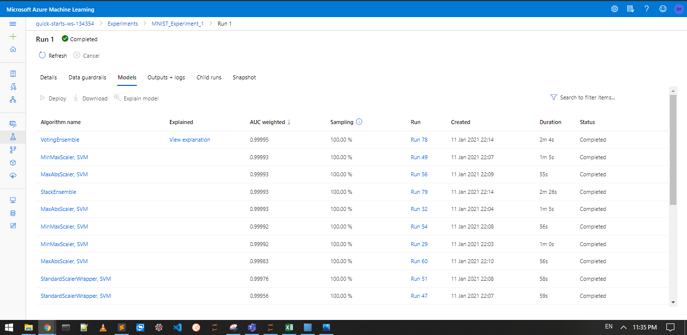

### Results
The best performing model after training using AutoML is VotingEnsemble with the AUC weighted as 0.99995 and accuracy as 0.99352

The other models that are used with VotingEnsemble and there weights are:
```
'ensembled_algorithms': "['MinMaxScalar SVM', 'MaxAbsScaler SVM', 'stackEnsemble',  'StandardScalarWrapper']"

'ensemble_weights': '[0.99993, 0.99992, 0.99985, 0.99956]'
```

To improve the model we can utilize distinctive objective measurement like AUC_weighted or Recall. We can likewise have a go at hypertuning the boundaries to check whether there is any improvement.

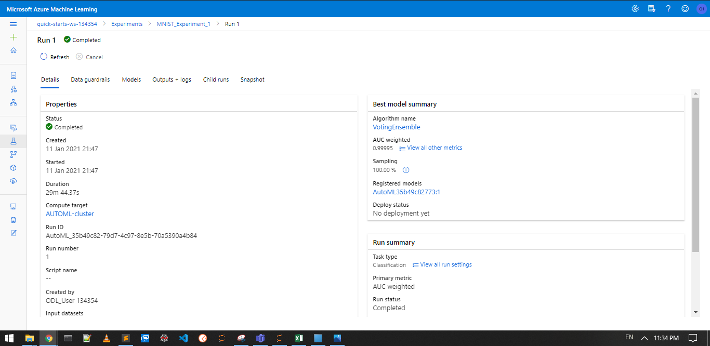
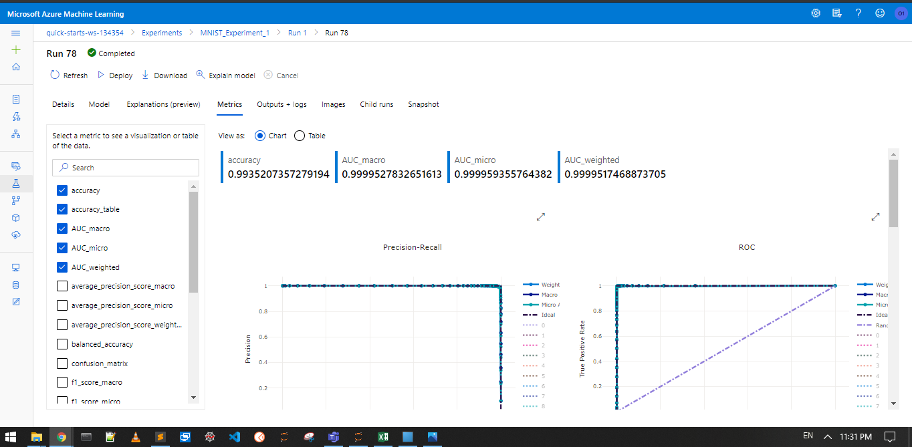

**Best Run Id**

Best Run Id of the model with the best run which is Voting Ensemble.

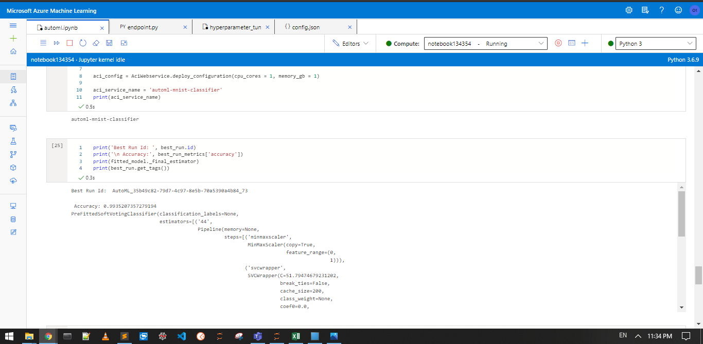

**Best AutoML Model Registered**

In order to deploy the model, we get the best model, register it and deploy it.

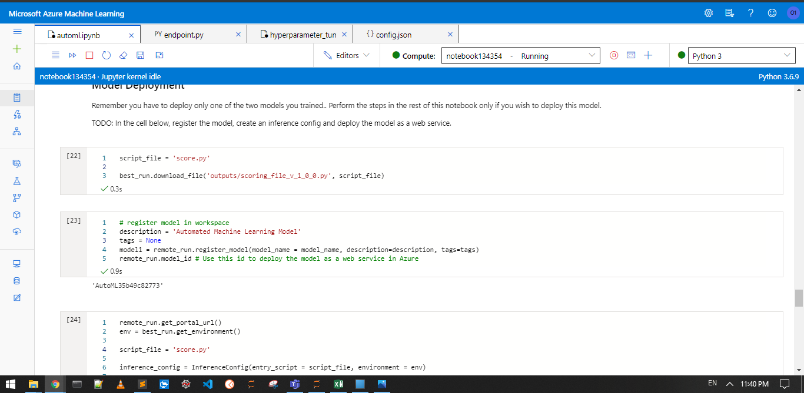

***

## Hyperparameter Tuning
As its a image classification task so we have used convolutional neural network to train it on the image dataset. I have used softmax as a activation function and for loss I have used categorical_crossentropy. 

The parameters used for hyperparameter tuning are:
- epochs (One Epoch is when an ENTIRE dataset is passed forward and backward through the neural network only ONCE. Since one epoch is too big to feed to the computer at once we divide it in several smaller batches.)
- batch_size (the number of training examples in one forward/backward pass. The higher the batch size, the more memory space you'll need.)
- dropout (The term “dropout” refers to dropping out units (both hidden and visible) in a neural network. Simply put, dropout refers to ignoring units (i.e. neurons) during the training phase of certain set of neurons which is chosen at random.)
- hidden (Number of hidden layers in neural network)

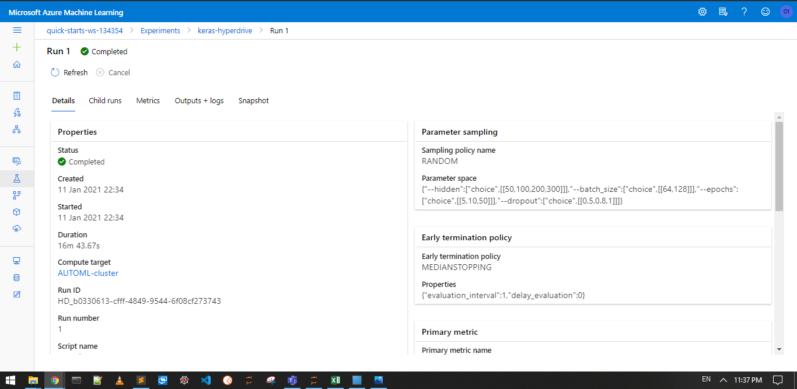

Here's a picture of Run details of the Hyperparameter Tuning
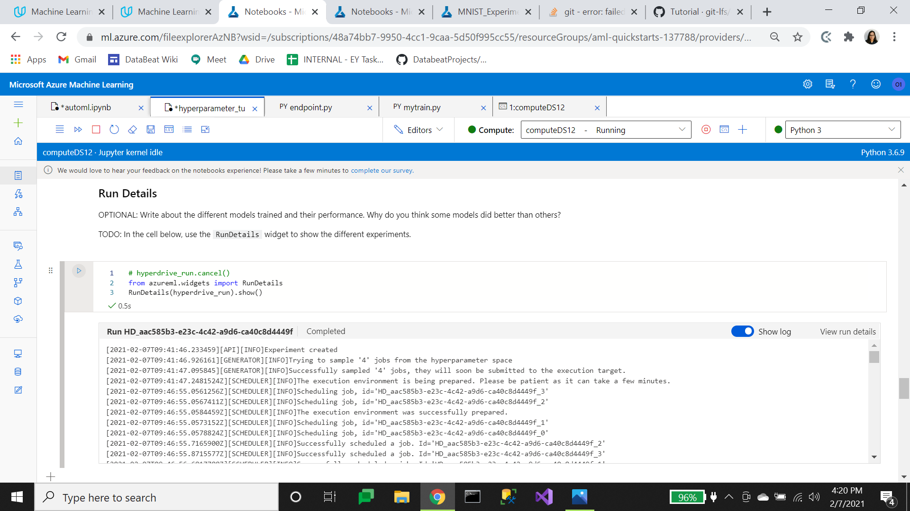

### Results
The best Accuracy for the HyperDrive model is 0.77799
The best hyperparameters for this accuracy are:
- 'hidden:': 300
- 'batch-size': 64
- 'drop-out': 0.5
- 'epoch': 50

To improve the model we can utilize diverse objective measurement to get more extensive point of view. We can likewise take a stab at expanding the scope of the hyperparameters to check whether there is any improvement.

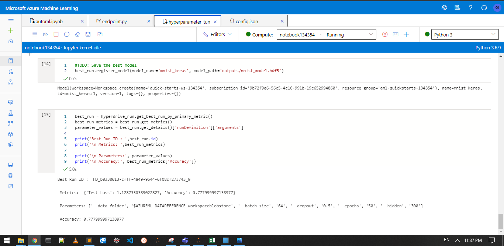


**Best HyperDrive Model Registered**

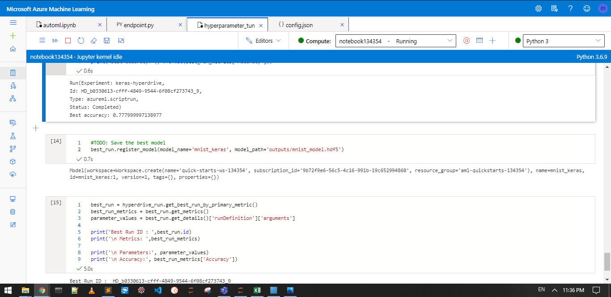

***
## Model Deployment
The AutoMl model is conveyed utilizing Azure Container Instance as a WebService. Best run environment and score.py document is given to the InferenceConfig. 

Cpu_cores and memory_gb are instated as 1 for the arrangement design. The aci administration is then made utilizing workspace, aci administration name, model, derivation config and sending arrangement. 

The model is effectively sent as a web administration and a REST endpoint is made with status Healthy. A scoring uri is likewise produced to test the endpoint.

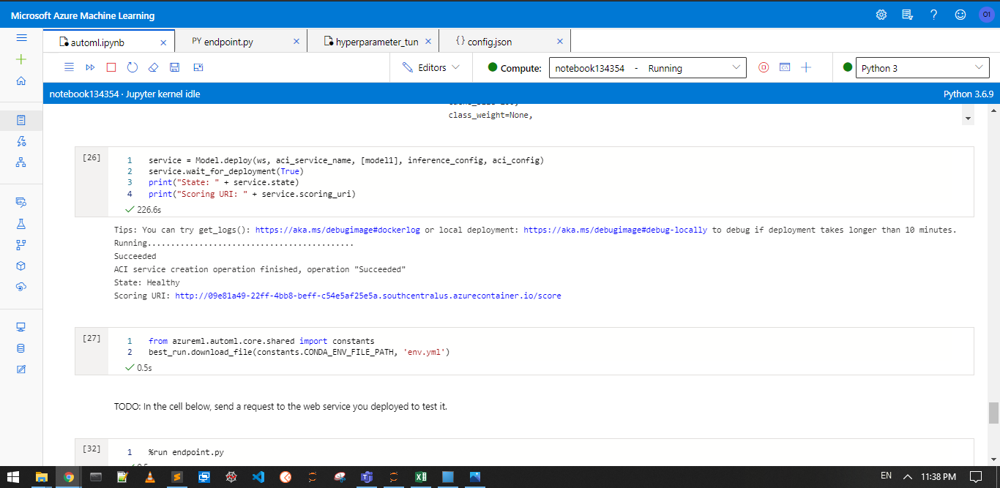

Health of the Deployed Model is Healthy. we can scroll down and check the scoring URI below. We can get the primary key from the Consume Tab.
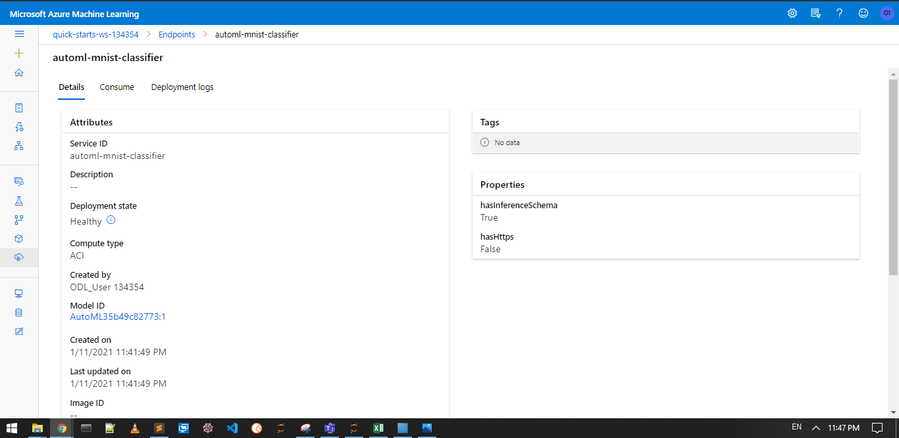

The endpoint is tested by following way: 
- using endpoint.py file which passes 1 data points as json to the scoring uri which return a label indicating which digit it is.
- endpint will accept the scoring uri and the primary key to access the deployed model.

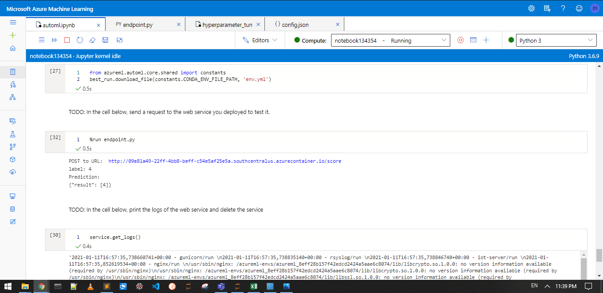

***
## Screen Recording
:movie_camera: [Click here for the Screencast](https://drive.google.com/file/d/1Uptc2ubOpj6qtl2ql1KUZOErJKyBZiih/view)

## Future Improvements
- Larger dataset can be used to increase data quality
- Different parameters can also be used with hyperparameter tuning
- Feature engineering can be performed using PCA 
- We can use max pooling to increase accuracy 
